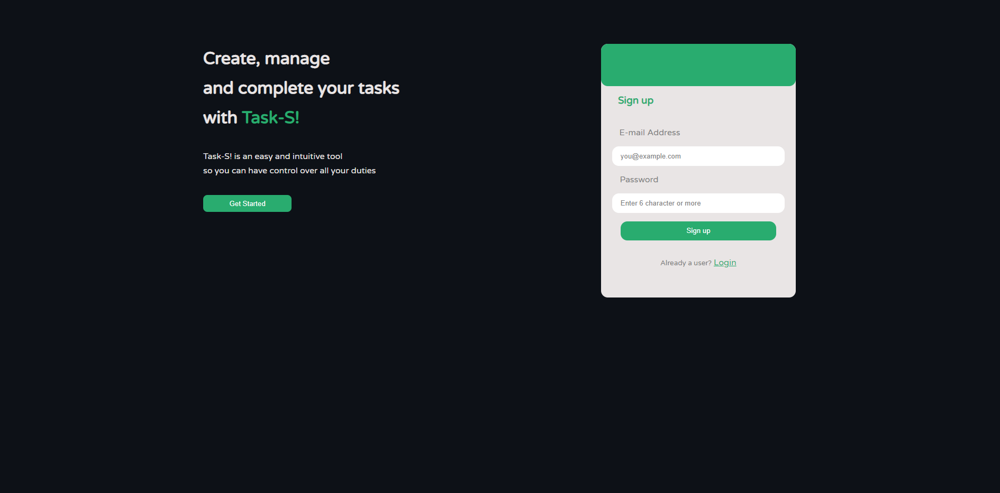
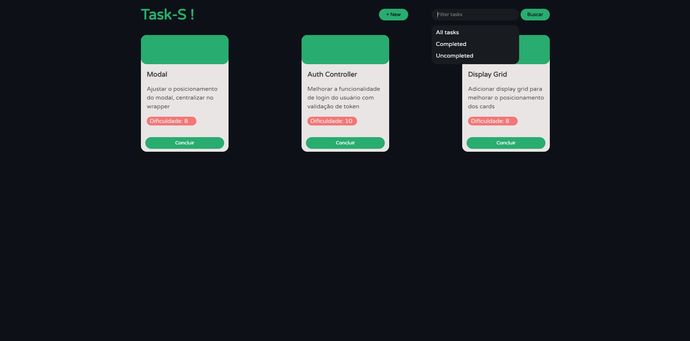

<h1> Task-s! </h1>

<p>
    This is task management software. Here you can manage your day-to-day tasks in an easy and intuitive way, in addition to classifying them in order of difficulty.
</p>

<br>

<p>
This project is in progress... But you can have an idea of what's to come.
</p>

<br>

<h3> Login page </h3>

<p> Here we have the login screen... It is very likely that the final product is nothing like what you are seeing... But for now this is what we have </p>



<br>

<h3> Tasks page </h3>

<p> This is the page where you can see all your tasks... The same login screen rule works for this one too... A lot of things tend to change, also because I'm a back-end developer... The front-end it's really not my strong point </p>



<br>

```js
    
    const allTechsUsed = [

        "TypeScript",
        "Express",
        "Ejs",
        "Bcrypt",
        "Body-Parser",
        "Config",
        "Express-Ealidator",
        "JsonWebToken",
        "Mongoose",
        "Morgan",
        "Winston",
        "SCSS",
        "JavaScript"

    ]

```
